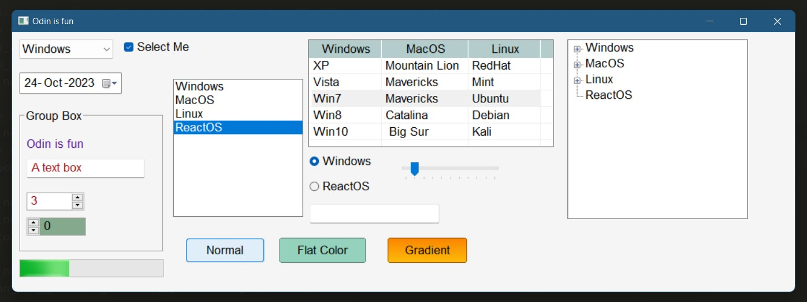

# Winforms
A simple GUI library for Odin programming language.

It is built upon win32 API functions. So it needs Windows 64 bit to run.
Currently, it's a work in progress project.

## Control List
Button, Calendar, CheckBox, ComboBox, DateTimePicker, GroupBox, Label, ListBox, TextBox
NumberPicker (Updown Control), ProgressBar, RadioButton, TrackBar, TreeView

## Screenshot




## Example --

This is the code used to create the window and controls in the above image.

```rust
import  wf "winforms"

frm : ^wf.Form
cal: ^wf.Calendar
cb : ^wf.CheckBox
dtp : ^wf.DateTimePicker
lb1 : ^wf.Label
lbx : ^wf.ListBox
np1 : ^wf.NumberPicker
np2 : ^wf.NumberPicker
tk : ^wf.TrackBar
tb : ^wf.TextBox
cmb : ^wf.ComboBox
tv : ^wf.TreeView
gb : ^wf.GroupBox
b1, b2, b3 : ^wf.Button
lv : ^wf.ListView
pgb: ^wf.ProgressBar
rb1: ^wf.RadioButton
rb2: ^wf.RadioButton

MakeWindow :: proc()
{
    using wf
    frm = new_form( txt = "Odin is fun")
    frm.width = 1100
    frm.font = new_font("Tahoma", 13)
    print_points(frm) // Handy function for design time. It prints the points we click
    create_handle(frm)

    // cal = new_calendar(frm, control_right(b1) + 10, 20, autoc = true)
    cmb = new_combobox(frm, 10, 10, autoc = true) // autoc will create the hwnd of this control.
    combo_add_items(cmb, "Windows", "MacOS", "Linux", "ReactOS")
    combo_set_selected_index(cmb, 0) // Make sure first item appear in combo

    cb = new_checkbox(frm, "Select Me", cright(cmb) + 15, 10, autoc = true)
    b1 = new_button(frm, "Normal", cright(cb) + 20, 10, 110, 35 )
    b1.onMouseClick = button_click_handler // Connect the event handler to an event
    control_set_backcolor(b1, 0xf48c06)

    dtp = new_datetimepicker(frm, 10, cbottom(cb) + 15, autoc = true)
    gb = new_groupbox(frm, "Group Box", 10, cbottom(dtp) + 40, autoc = true)
    lbx = new_listbox(frm, 223, 65, autoc = true)
    listbox_add_items(lbx, "Windows", "MacOS", "Linux", "ReactOS")

    lv = new_listview(frm, 410, 10, 340, 150, "Windows", "MacOS", "Linux", 100, 120, 100)
    listview_add_row(lv, "XP", "Mountain Lion", "RedHat")
    listview_add_row(lv, "Vista", "Mavericks", "Mint")
    listview_add_row(lv, "Win7", "Mavericks", "Ubuntu")
    listview_add_row(lv, "Win8", "Catalina", "Debian")
    listview_add_row(lv, "Win10", " Big Sur", "Kali")

    np1 = new_numberpicker(frm, cright(gb) + 20, cbottom(lbx) + 20, autoc = true)
    np2 = new_numberpicker(frm, cright(gb) + 20, cbottom(np1) + 10, autoc = true)

    pgb = new_progressbar(frm, 10, cbottom(gb) + 10, autoc = true)

    rb1 = new_radiobutton(frm, "Windows", cright(lbx) + 10, cbottom(lv) + 10, autoc = true)
    rb2 = new_radiobutton(frm, "ReactOS", cright(lbx) + 10, cbottom(rb1) + 10, autoc = true)

    lb1 = new_label(frm, "Odin is fun", gbx(gb, 10), gby(gb, 40), autoc = true)
    tb = new_textbox(frm, cright(lbx) + 10, cbottom(rb2) + 10, autoc = true)
    tb2 := new_textbox(frm, "A text box", 20, gby(gb, 70), autoc = true)

    tk = new_trackbar(frm, cright(rb1) + 20, cbottom(lv) + 20)
    tv = new_treeview(frm, cright(lv) + 20, 10, 250, 250, autoc = true)
    treeview_add_nodes(tv, "Windows", "MacOS", "Linux", "ReactOS")
    treeview_add_childnodes(tv, 0, "XP", "Vista", "Win7", "Win8", "Win10", "Win11")
    treeview_add_childnodes(tv, 1, "Mountain Lion", "Mavericks", "Catalina", " Big Sur", "Monterey")
    treeview_add_childnodes(tv, 2, "RedHat", "Mint", "Ubuntu", "Debian", "Kali")

    start_mainloop(frm) // All set, we can now start our form.
}

button_click_handler :: proc(sender : ^wf.Control, ea : ^wf.EventArgs)
{
    wf.msgbox("Hi, I am from winforms !")
}

main :: proc()
{
    track: mem.Tracking_Allocator // It's easy to check the memory leaks
    mem.tracking_allocator_init(&track, context.allocator)
    context.allocator = mem.tracking_allocator(&track)
    defer mem.tracking_allocator_destroy(&track)

    MakeWindow()
    wf.show_memory_report(&track) // Yes! Winforms provide a function to print the memory report
}

```

## How to use --
1. Download or clone repo.
2. Copy the folder **winforms** and paste it in project folder.
3. Import **winforms** in your main file. Done !!! 👍

## Note
To enable visual styles for your application, you need to use a manifest file.
Here you can see a **app.exe.manifest** file in this repo. You can copy paste it in your project folder. Then rename it. The name must be your exe file's name. Here in my case, my exe file is **app.exe**. So my manifest file's name is **app.exe.manifest**. However, you can use a reource file and put an entry for this manifest file in it. Then you can compile the app with the manifest data embedded into your exe.
